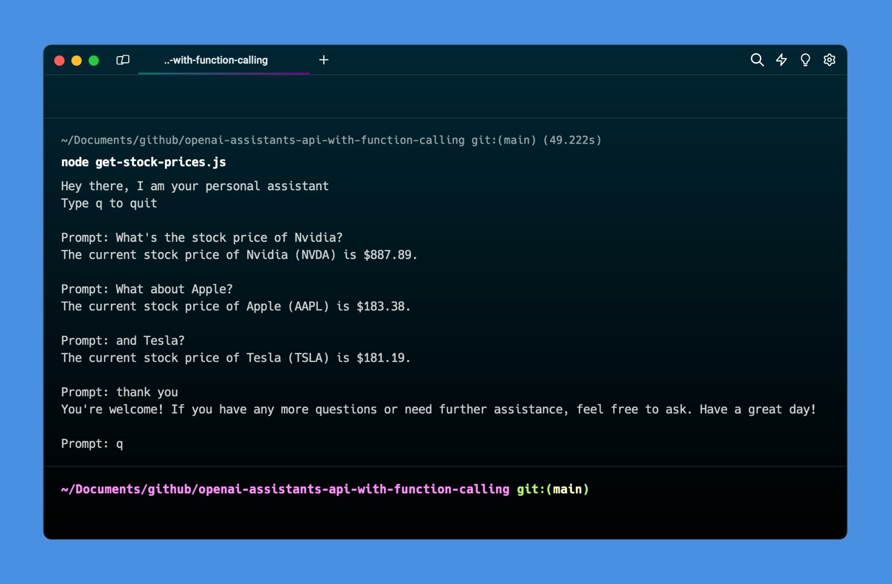

# OpenAI Assistants API with Function Calling

Just a demo of OpenAI's Assistants API with function calling, currently it checks for the realtime stock prices

## Preview



## Usage

Clone this repository

```
git clone https://github.com/ozgrozer/openai-assistants-api-with-function-calling.git
```

Install dependencies

```
yarn install
# or
npm install
```

Duplicate `.env.example` as `.env` and update your credentials

```
cp .env.example .env
vim .env
```

Run the script

```
node get-stock-prices.js
```

And here's the expected result

```
Hey there, I am your personal assistant
Type q to quit

Prompt: What's the stock price of Nvidia?
The current stock price of Nvidia is $887.89.

Prompt: q
```
